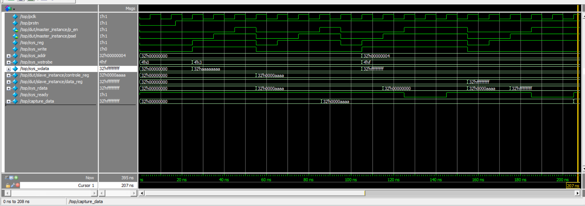

# AMBA APB4 Protocol Implementation & Verification

## 📌 Project Overview
This project is a fully functional, spec-compliant Verilog RTL implementation of an AMBA APB4 (Advanced Peripheral Bus) Master-Slave system. Designed for low-power, low-bandwidth peripheral communication in SoC architectures, this project focuses on strict protocol adherence, hardware-level optimizations, and robust testbench verification.

## 🚀 Key Features Implemented
* **Standard 2-Cycle Transfers:** Implements the official AMBA APB state machine transitions (`IDLE` $\rightarrow$ `SETUP` $\rightarrow$ `ACCESS`).
* **APB4 Byte Strobes (`PSTRB`):** Fully supports sparse writes. Byte-level masking is handled directly by the Write Enable pins inside the Slave's address decoder, updating specific bytes (e.g., writing `0000aaaa` using strobe `4'b0011`) without requiring software Read-Modify-Write cycles.
* **Wait-State Generation (`PREADY`):** Implements dynamic wait-state logic. The slave successfully asserts `PREADY = 0` and utilizes a `wait_counter` to stall the bus when the data register (`0x04`) is accessed, proving the Master FSM can hold the `ACCESS` phase appropriately.
* **Master-Side PPA Optimization:** Compliant with the AMBA specification, the Master passes raw data without masking un-strobed lanes (leaving them as "Don't Care"). This avoids redundant multiplexers, optimizing silicon area and dynamic switching power.

## 🏗️ Architecture Design
The system consists of three main modules:
1. **Master (`master.v`):** An FSM-driven module that translates generic CPU read/write signals (`sys_write`, `sys_addr`) into strictly timed APB4 bus signals (`PSEL`, `PENABLE`, `PWRITE`).
2. **Slave (`apb_slave.v`):** A memory-mapped peripheral with an internal Control Register (`0x00`) and Data Register (`0x04`). Contains `PSTRB` logic and wait-state counters. 
3. **Wrapper (`mas2slav.v`):** The top-level DUT integrating the Master and Slave to expose a clean, generic CPU interface to the verification environment.

## 🧪 Verification Strategy
The testbench (`top.v`) utilizes automated tasks (`cpu_write`, `cpu_read`) to simulate realistic processor transactions:
* **Byte Strobe Verification:** Tests partial word writes by writing `32'haaaaaaaa` with a strobe of `4'b0011`, successfully reading back `32'h0000aaaa`.
* **Bus Race-Condition Prevention:** Implemented a snapshot mechanism (`capture_data`) that safely latches combinational read data on the exact clock edge `PREADY` asserts, decoupling the verification checks from transient bus clearance during the `IDLE` transition.
* **Wait-State Verification:** Tests read/write operations to `0x04` to ensure the Master correctly respects the Slave's `PREADY` delay.

## 💻 Simulation & Waveforms
This project was simulated and verified using **Siemens Questa Sim**.

The waveform below demonstrates successful Master-Slave handshaking, byte-strobe masking on the `controle_reg`, wait-state handling on the `data_reg`, and stable `capture_data` sampling in the testbench.



### Expected Console Output
```text
--starting test 1:basic transfer--
test 1 is pass wrote aaaaaaaa,read=0000aaaa

--- Starting Test 2: Corner Case ---
test 2 pass: Data FFFFFFFF perfectly transferred

--- Starting Test 3: Corner Case ---
test 3 pass: Data dddddddd perfectly transferred

--- the process is completed ---
